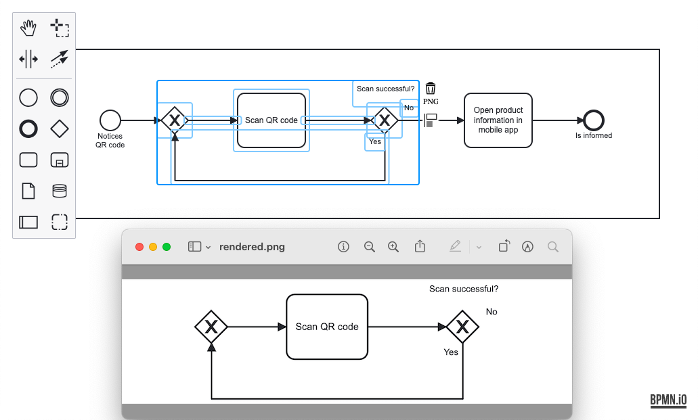

# bpmn-js-copy-as-image

[](https://github.com/barmac/bpmn-js-copy-as-image/actions/workflows/CI.yml)

This project allows to capture elements as PNG or SVG programmatically, and to copy rendered PNG to the clipboard via context pad.



## Features

* copy selected elements as PNG via the context pad
* render elements as PNG
* render elements as SVG

## Usage

The project exposes 2 modules which can be used with [bpmn-js](https://github.com/bpmn-io/bpmn-js).

### Context pad extension

To use the context pad extension, import the `CopyAsImageModule`:

```javascript
import BpmnModeler from 'bpmn-js/lib/Modeler';
import { CopyAsImageModule } from 'bpmn-js-copy-as-image';

const modeler = new BpmnModeler({
  container: '#container',
  additionalModules: [
    CopyAsImageModule
  ]
});

await modeler.importXML(/* ... */);
```

### Programmatic API only

The programmatic API is included in the context pad extension. If you want to use only the former,
import only the `ElementsRendererModule`:


```javascript
import BpmnModeler from 'bpmn-js/lib/Modeler';
import { ElementsRendererModule } from 'bpmn-js-copy-as-image';

const modeler = new BpmnModeler({
  container: '#container',
  additionalModules: [
    ElementsRendererModule
  ]
});

await modeler.importXML(/* ... */);

const elementsRenderer = modeler.get('elementsRenderer');
const png = await elementsRenderer.renderAsPNG([ 'Task_1' ]);
```

## Demo

```
# install dependencies
npm install

# run in browser
npm run dev
```

Go to http://localhost:9876/debug.html.

## Credits

The project was built on top of @nikku's [native copy and paste example](https://github.com/nikku/bpmn-js-native-copy-paste).

## License

MIT
